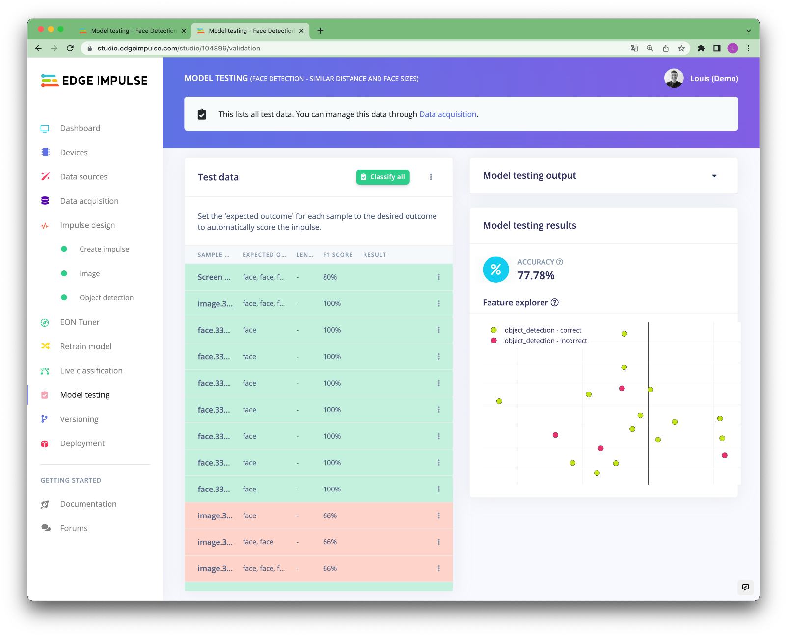
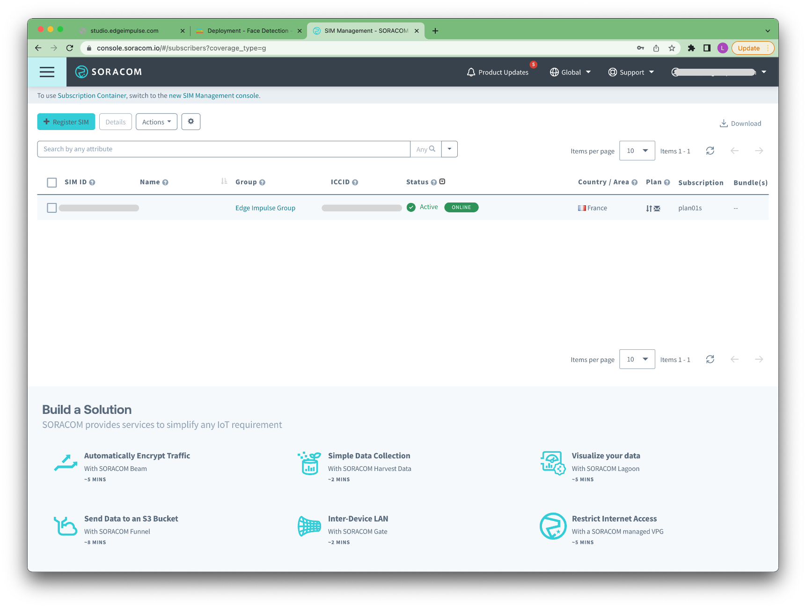
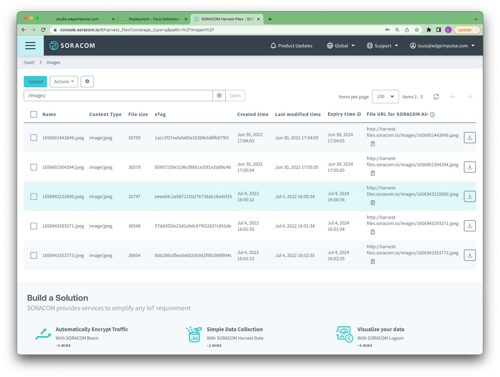
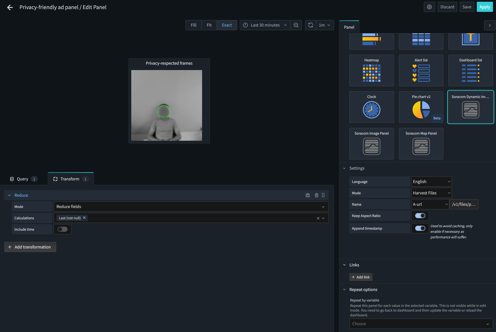

# Privacy-friendly Advertising Panel

Advertising screens installed in public spaces, equipped with cameras and other sensors are becoming more and more popular. They offer new ways of interacting with the panel while gathering useful metrics for advertisers: They allow them to count the number of passages made in front of them, measure the time of exposure, and, automatically change the advertising display based on the number of people that are passing by.

However, many passers-by do not wish to be filmed in public spaces. And this is completely understandable!

This is why several companies started to work on "on-device anonymization" techniques using edge machine learning.

[Edge Impulse](https://edgeimpulse.com), [Soracom](https://www.soracom.io/) and [Seeed Studio](https://www.seeedstudio.com/) have partnered to build this tutorial to show you how to build a privacy-friendly advertising panel including: 

- Training a machine learning model to detect the faces using Edge Impulse.

- Building a web application running locally on the Seeed reComputer Jetson:


- Setup a remote dashboard using Soracom Lagoon service:


## Workshop's video

[](https://www.youtube.com/watch?v=G2TIFtG-PbM)

## Requirements

This proof of concept project has been built using:

- A [Seeed reComputer Jetson](https://wiki.seeedstudio.com/reComputer_getting_started/)
- An external USB camera
- [Soracom LTE USB Dongle](https://www.soracom.io/store/onyx-usb-modem-sim-connectivity/)


All the processing is done on the Seeed reComputer Jetson, the information sent contains the average number of people present in front of the screen (every 10 seconds) and a snapshot of the anonymized image every minute that can be used for further processing if needed.

You will need an account on [Edge Impulse Studio](https://studio.edgeimpulse.com/) to build your machine learning model and an account on [Soracom console](https://console.soracom.io/) to retrieve the metrics provided by the advertising screen.

## Build your machine learning model

For this project, we are using [Edge Impulse FOMO](https://docs.edgeimpulse.com/docs/edge-impulse-studio/learning-blocks/object-detection/fomo-object-detection-for-constrained-devices) (Faster Objects, More Objects). It is a novel machine-learning algorithm that brings object detection to highly constrained devices. It lets you count objects, find the location of objects in an image, and track multiple objects in real-time using up to 30x less processing power and memory than MobileNet SSD or YOLOv5.

This means FOMO models will run very fast even on a Seeed reComputer Jetson (around 35 FPS in this case). However, it removes one of the useful advantages of MobileNet SSD of YOLOv5 which are the bounding boxes.

FOMO is trained on centroid, thus will provide only the location of the objects and not their size.


As you can see in the animation above, the portion the face is taking in the frame is very different depending on how close we are to the camera. This sounds logical but it can bring one complexity to the end application. We would need to place the camera where the people will mostly be at a similar distance. Here we have optimized the model to work in its **ideal condition if the subjects are placed between 1.5 and 2 meters away from the camera**.

But do not worry if you have different parameters, Edge Impulse has been built so you can create your custom machine learning models. Just collect another dataset, more suitable for your use case and retrain your model.

If you have more processing power, you can also use MobileNet SSD pre-trained models to train your custom machine learning models. Those will provide bounding boxes around the person:


Now that you understood the concept, we can create our custom machine learning model.

### Setup your Edge Impulse project

If you do not have an Edge Impulse account yet, start by creating an account on [Edge Impulse Studio]((https://studio.edgeimpulse.com/)) and create a project.


You will see a helper to help you set up your project type.
Select **Images -> Classify multiple objects (object detection) -> Let's get started**


That's it now your project is set up and we can start collecting images.

### Collect your dataset

As said before, for this project to work in its nominal behavior, the faces have to be between 1.5 and 2 meters away from the camera. So let's start collecting our dataset. To do so, navigate to the **Data acquisition** page.

We provide several options to collect images, please have a look at [Edge Impulse documentation website](https://docs.edgeimpulse.com/docs/edge-impulse-studio/data-acquisition).

We have used the mobile phone option. Click on **Show options**:


Flash the QR Code with your mobile phone and start collecting data.

*Ideally, you want your pictures to be as close as the production environment. For example, if you intend to place your advertising screen in a mall, try to collect the pictures at the same place where your screen will be. This is not always possible for an application that will be deployed in unknown places, in that case, try to keep diversity in the images you will collect. You will probably need more data to obtain a good accuracy but your model will be more general.*

Collect about 100 images and make sure you **split** your samples between your **training set** and your **testing set**. We will use this test dataset to validate our model later. To do so, click on **Perform a train/test split** under the **Dashboard** view.

Go back to the **Data acquisition** view and click on the **Labeling queue**.

.

This will open a new page where you can manually draw bounding boxes around the faces:


*This process can be tedious, however, having a good dataset will help in reaching a good accuracy.*

>For advanced users, if you want to upload data that already contains bounding boxes, the [uploader](https://docs.edgeimpulse.com/docs/edge-impulse-studio/data-acquisition/uploader) can label the data for you as it uploads it. In order to do this, all you need is to create a bounding_boxes.labels file in the same folder as your image files. The contents of this file are formatted as JSON with the following structure:

```
{
    "version": 1,
    "type": "bounding-box-labels",
    "boundingBoxes": {
        "mypicture.jpg": [{
            "label": "face",
            "x": 119,
            "y": 64,
            "width": 206,
            "height": 291
        }, {
            "label": "face",
            "x": 377,
            "y": 270,
            "width": 158,
            "height": 165
        }]
    }
}
```

Once all your data has been labeled, you can navigate to the **Create Impulse tab**

### Create your machine learning pipeline

After collecting data for your project, you can now create your Impulse. A complete Impulse will consist of 3 main building blocks: an input block, a processing block, and a learning block.

**Here you will define your own machine learning pipeline.**

One of the beauties of FOMO is its fully convolutional nature, which means that just the ratio is set. Thus, it gives you more flexibility in its usage compared to the classical Object detection method. For this tutorial, we have been using **96x96 images** but it will accept other resolutions as long as the images are square.
To configure this, go to Create impulse, set the image width and image height to '**96**', the resize mode to '**Fit the shortest axis**' and, add the '**Images**' and '**Object Detection (Images)**' blocks. Then click Save impulse.


### Pre-process your images

Generating features is an important step in Embedded Machine Learning. It will create features that are meaningful for the Neural Network to learn on instead of learning directly from the raw data.

To configure your processing block, click **Images** in the menu on the left. This will show you the raw data on top of the screen (you can select other files via the drop-down menu), and the results of the processing step on the right. You can use the options to switch between 'RGB' and 'Grayscale' modes. Then click **Save parameters**.


This will send you to the 'Feature generation' screen that will:

- Resize all the data.
- Apply the processing block on all this data.
- Create a 2D visualization of your complete dataset.

Click **Generate features** to start the process.

### Train your model using FOMO

With all data processed it's time to start training our FOMO model. The model will take an image as input and output the objects detected using centroids.


### Validate your model using your test dataset

With the model trained we can try it out on some test data. When we collected our images, we split the data up between a training and a testing dataset. The model was trained only on the training data, and thus we can use the data in the testing dataset to validate how well the model will work on data that has been unseen during the training.



### Validate your model your Seeed reComputer Jetson

With the impulse designed, trained, and verified we can now deploy this model back to our device.

This makes the model run without an internet connection, minimizes latency, and runs with minimum power consumption. Edge Impulse can package up the complete impulse - including the preprocessing steps, neural network weights, and classification code - in a single C++ library or linux executable that you can include in your embedded software.

*In this tutorial, we are using a Seeed reComputer Jetson but the following procedures should work on any Raspberry Pi 4, Linux x86 or MacOS devices.*

 From your Seeed reComputer Jetson, make sure to install the dependencies. You can find the procedure on the [Edge Impulse documentation website](https://docs.edgeimpulse.com/docs/development-platforms/community-boards/seeed-recomputer-jetson)

From your Seeed reComputer Jetson terminal, simply run `edge-impulse-linux-runner --clean`. 


This will build and download your model, and then run it on your development board. If you're on the same network you can get a view of the camera, and the classification results directly from your dev board. You'll see a line like:

```
Want to see a feed of the camera and live classification in your browser? Go to http://192.168.8.117:4912
```

Open that link in a browser, Edge Impulse ships a small web page to see the live results.


Great, now we have a model that can locate our faces in the image!

Now to anonymize the image, several techniques exist, from a simple blurring technique to CLEANIR or DeepPrivacy models that can preserve some useful features for further processing (age, gender, look direction).
We don't want to enter into that complexity here as we want to keep our application lightweight, so we will just draw a white circle on top of the faces in the images or blur the region where a face is located.

## Use Edge Impulse Python SDK to integrate your custom model in a custom application

We built a small Python application that will run the inference on your device, blur the region where the faces are and display a web page with the results.

You can freely customize this application as you wish to create something that specifically match your business logic!

To run the application you will need to install [Python3](https://www.python.org/downloads/) its package manager `pip3`.

Clone [this repository](https://github.com/edgeimpulse/workshop-soracom-privacy-friendly-adverstising-panel) locally:

```
git clone https://github.com/edgeimpulse/workshop-soracom-privacy-friendly-adverstising-panel
cd workshop-soracom-privacy-friendly-adverstising-panel/
```

Install the dependencies:

```
pip3 install -r requirements.txt
```

You will also need to install `flask`:

```
pip3 install -U Flask
```

Download your custom model at the root of this repository:

```
edge-impulse-linux-runner --download modelfile.eim
```

And run the application:

```
python3 app.py
```


*Note: If you have several webcams attached to your computer, you can change the index of your camera in `app.py` line 16: `videoCaptureDeviceId = int(0) # use 0 for web camera`. You can also import a video stream and adapt the code easily, feel free to have a look at our [python images example](https://github.com/edgeimpulse/linux-sdk-python/tree/master/examples/image).*

*Note 2: If you are planning on using this on a distant device and don't have access to a monitor connected to that device, replace the last line with: `app.run(host="0.0.0.0", debug=True)`, it will broadcast the web application to your local network.*

## Send the inference results with Soracom

We have been using the [Soracom Onyx LTE USB Modem + IoT SIM Card](https://www.soracom.io/store/onyx-usb-modem-sim-connectivity/) to send the inference results to Soracom services (Harvest Data & Harvest Files). We also used Soracom Lagoon to display the results on the Grafana-based dashboard service.

To learn more about all Soracom services, please have a look at [Soracom developer docs](https://developers.soracom.io/en/docs/).

To set up the Soracom Onyx LTE USB Modem, follow [this guide](https://developers.soracom.io/en/start/connect/soracom-onyx-lte/). The **Automated Installation** worked without any issue on our case:

**Automated Installation (copied from Soracom Developer Guide)**

*For your convenience, we provide a simple shell script that automates the process of installing NetworkManager and configuring it for use with Soracom.*

SSH into your device and download the setup script:

```
sudo curl -O https://soracom-files.s3.amazonaws.com/connect/setup_eg25.sh
```

Next, modify the file properties so that it can be executed:

```
sudo chmod +x setup_eg25.sh
```

Run the script and follow the prompts:

```
sudo ./setup_eg25.sh
```

Once the script finishes the installation, your device should automatically connect to a cellular network using the Onyx LTE dongle. You can then control the connection by using `sudo nmcli con up soracom` and `sudo nmcli con down soracom` commands.

When done, log into your Soracom account and register your SIM if it has not been done automatically:



Add your SIM to a group: **Menu -> Group -> + Add Group**

In your group settings, enable **SORACOM Harvest Data** and **SORACOM Harvest Files**


And then, from the menu, open **DATA STORAGE & VISUALISATION -> SORACOM Harvest Data**:

From your RPI, edit the `app.py` script and enable the `use_soracom` flag

```
use_soracom = True
```

Launch the script:

```
python3 app.py 
 * Serving Flask app 'app' (lazy loading)
 * Environment: production
   WARNING: This is a development server. Do not use it in a production deployment.
   Use a production WSGI server instead.
 * Debug mode: on
 * Running on all addresses (0.0.0.0)
   WARNING: This is a development server. Do not use it in a production deployment.
 * Running on http://127.0.0.1:5000
 * Running on http://192.168.1.173:5000 (Press CTRL+C to quit)
 * Restarting with stat
 * Debugger is active!
 * Debugger PIN: 552-723-498

```

Open a webpage on the provided URL (http://192.168.1.173:5000 in our case or http://127.0.0.1:5000 if you have a monitor connected to your Seeed reComputer Jetson and you can access a webpage locally):

The script will automatically upload to Soracom the number of people detected in front of the camera every 10 seconds and will upload an anonymized image every minute:


*Note: Make sure to select your SIM resource on the top-left filter.*

To find the uploaded images, navigate to **DATA STORAGE & VISUALISATION -> SORACOM Harvest Files**:



Finally, let's display all this information together in a simple dashboard using **Soracom Lagoon**


Soracom Lagoon will automatically fetch the fields available from Harvest. To add a widget, just click on the top right corner and select the widget you want to add, here we added a simple **Gauge** and a **Graph** to display the number of people.

To add the image, you will need to select a **Soracom Dynamic Image** widget and configure it as follow:



Et voilà !

Do not hesitate to reproduce this tutorial and let us know if you have any question on [Edge Impulse Forum](https://forum.edgeimpulse.com/), we'd be happy to help you.
