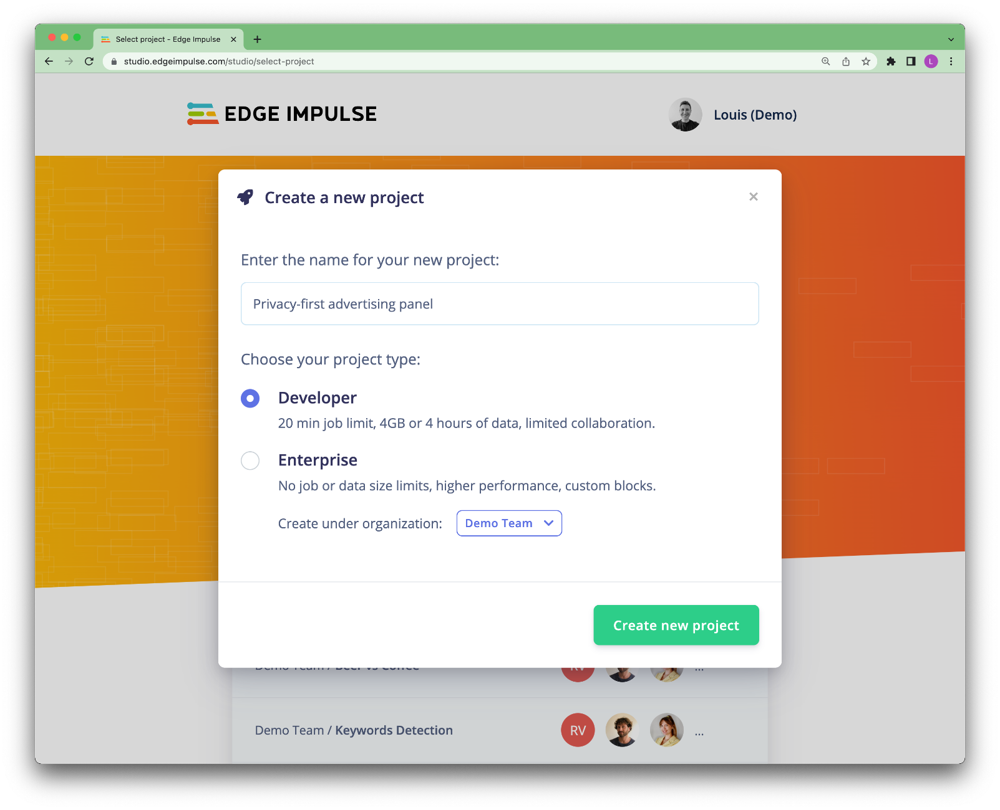
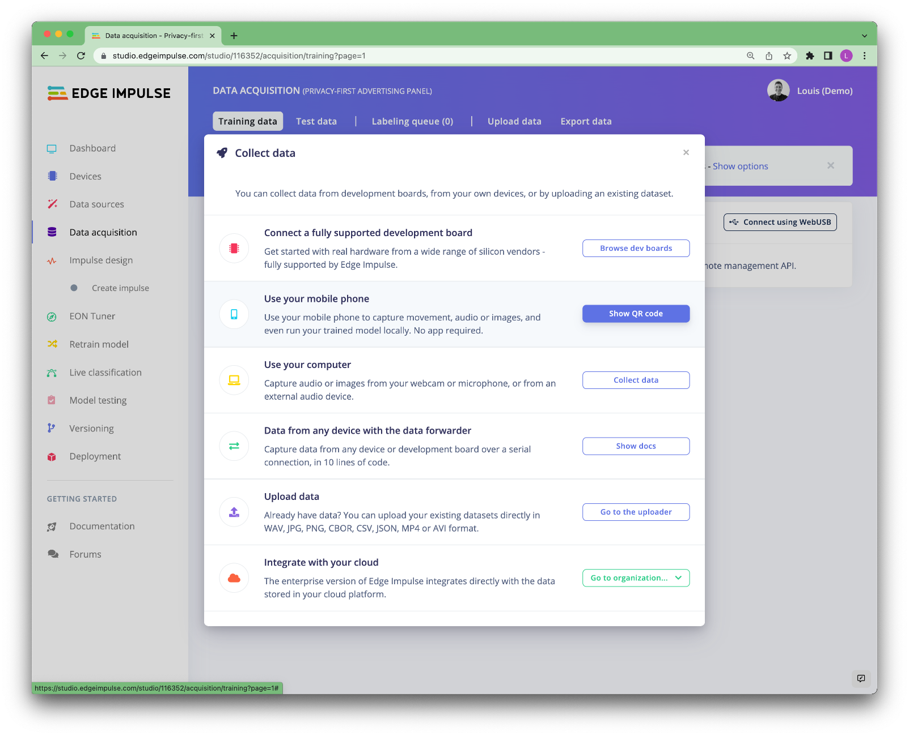
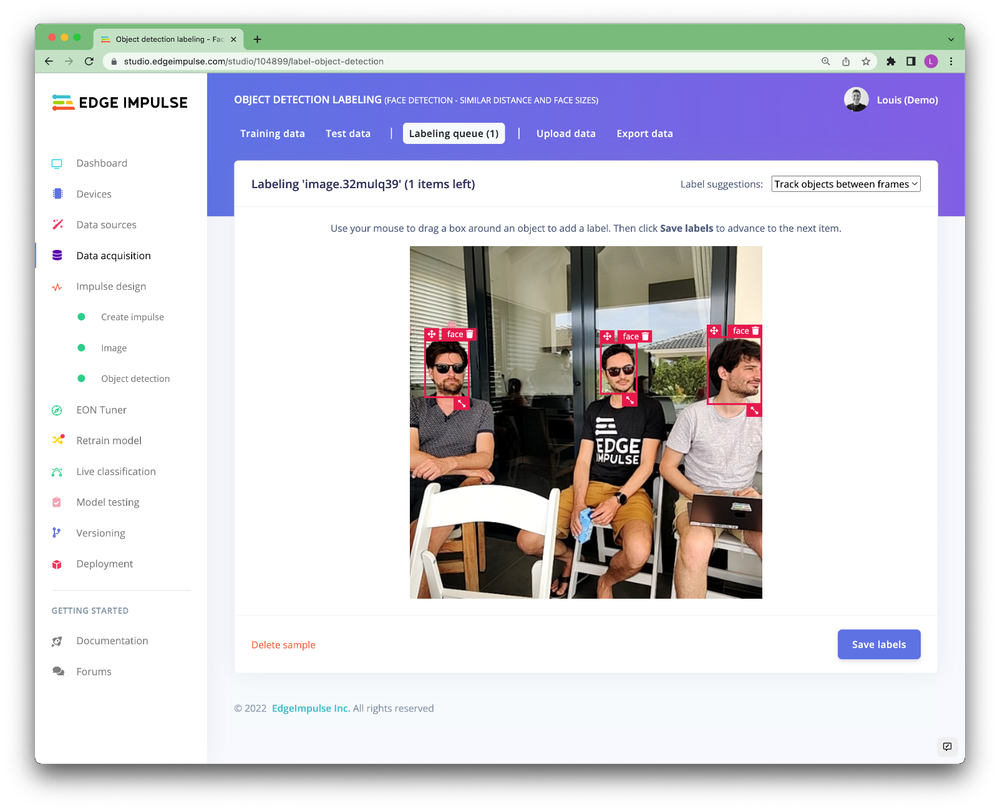

# Privacy-friendly Adverstising Panel

Advertising screens installed in public spaces, equipped with camera and other sensors are extremely useful.

They allow to count the number of passages made in front of them, to measure the time of exposure to the advertising message, and to automatically change the advertising display based on the number of people that are passing by.

However, most people don't like being filmed in public spaces. 

This is why recently several companies worked on "on-device anonymisation" techniques using edge machine learning.

[Edge Impulse](https://edgeimpulse.com) and [Soracom](https://www.soracom.io/) have partnered to build this tutorial to show you how to build a privacy-friendly advertising panel.


## Requirements

This proof of concept project has been build using:

- A Rapsberry Pi 4
- An external USB camera
- Soracom LTE USB Dongle

All the processing is done on the Raspberry Pi, the information sent contain the average number of people present in front of the screen (every 10 seconds) and a snapshot of the anonymised image every minute that be can be used for further processing if needed.

You will need an account on [Edge Impulse Studio](https://studio.edgeimpulse.com/) to build your machine learning model and an account on [Soracom console](https://console.soracom.io/) to retrieve the metrics provided by the advertising screen.

## Build your machine learning model

For this project, we are using [Edge Impulse FOMO](https://docs.edgeimpulse.com/docs/edge-impulse-studio/learning-blocks/object-detection/fomo-object-detection-for-constrained-devices) (Faster Objects, More Objects). It is a novel machine learning algorithm that brings object detection to highly constrained devices. It lets you count objects, find the location of objects in an image, and track multiple objects in real-time using up to 30x less processing power and memory than MobileNet SSD or YOLOv5.

This means FOMO models will run very fast even on a Raspberry Pi 4 (around 35 FPS in this case). However, it removes one of the useful advantage of MobileNet SSD of YOLOv5 which are the bounding boxes.

FOMO is trained on centroid, thus will provide only the location of the objects and not their size.


As you can see in the animation above, the portion the face is taking in the frame is very different depending on how close I am from the camera. This sounds logic but it can bring one complexity for the end application. We would need to place the camera where the people will mostly be at a similar distance. Here we have optimized the model to work in its **ideal condition if the subjects are placed between 1.5 and 2 meters away from the camera**.

But do not worry if you have different parameters, Edge Impulse has been built so you can create your custom machine learning models. Just collect another dataset, more suitable for your use case and retrain your model.

If you have more processing power, you can also use MobileNet SSD pre-trained models to train your custom machine learning models. Those will provide bounding boxes around the person:


Now that you understood the concept, we can create our custom machine learning model.

### Setup your Edge Impulse project

If you do not have an Edge Impulse account yet, start by creating an account on [Edge Impulse Studio]((https://studio.edgeimpulse.com/)) and create a project.



You will see a helper to help you setup your project type.
Select **Images -> Classify multiple objects (object detection) -> Let's get started**


That's it now your project is set up and we can start collecting images.

### Collect your dataset

As said before, for this project to work in its nominal behaviour, the faces has to be between 1.5 and 2 meters away from the camera. So let's start collecting our dataset. To do so, navigate to the **Data acquisition** page.

We provide several options to collect images, please have a look at [Edge Impulse documentation website](https://docs.edgeimpulse.com/docs/edge-impulse-studio/data-acquisition).

We have used the mobile phone option. Click on **Show options**:




Flash the QR Code with your mobile phone and start collecting data.

*Ideally you want your pictures to be as close as the production environment. For example, if you intend to place your advertising screen on a mall, try to collect the pictures at the same place where your screen will be. This is not always possible for an application that will be deployed on unknown places, in that case, try to keep diversity in the images you will collect. You will probably need more data to obtain a good accuracy but your model will be more general.*

Collect about 100 images and make sure you **split** your samples between your **training set** and your **testing set**:

.

Click on **Labeling queue**. This will open a new page where you can manually draw bounding boxes around the faces:

.

*This process can be tedious, however having a good dataset will help on reaching a good accuracy.*

>For advanced user, if you want to upload data that already contains bounding boxes, the [uploader](https://docs.edgeimpulse.com/docs/edge-impulse-studio/data-acquisition/uploader) can label the data for you as it uploads it. In order to do this, all you need is to create a bounding_boxes.labels file in the same folder as your image files. The contents of this file are formatted as JSON with the following structure:

```
{
    "version": 1,
    "type": "bounding-box-labels",
    "boundingBoxes": {
        "mypicture.jpg": [{
            "label": "face",
            "x": 119,
            "y": 64,
            "width": 206,
            "height": 291
        }, {
            "label": "face",
            "x": 377,
            "y": 270,
            "width": 158,
            "height": 165
        }]
    }
}
```

Once all your data has been labeled, you can navigate to the **Create Impulse tab**

### Train your model

### Validate your model using your test dataset

### Validate your model on the device


## Setup Soracom


## Run the end application


